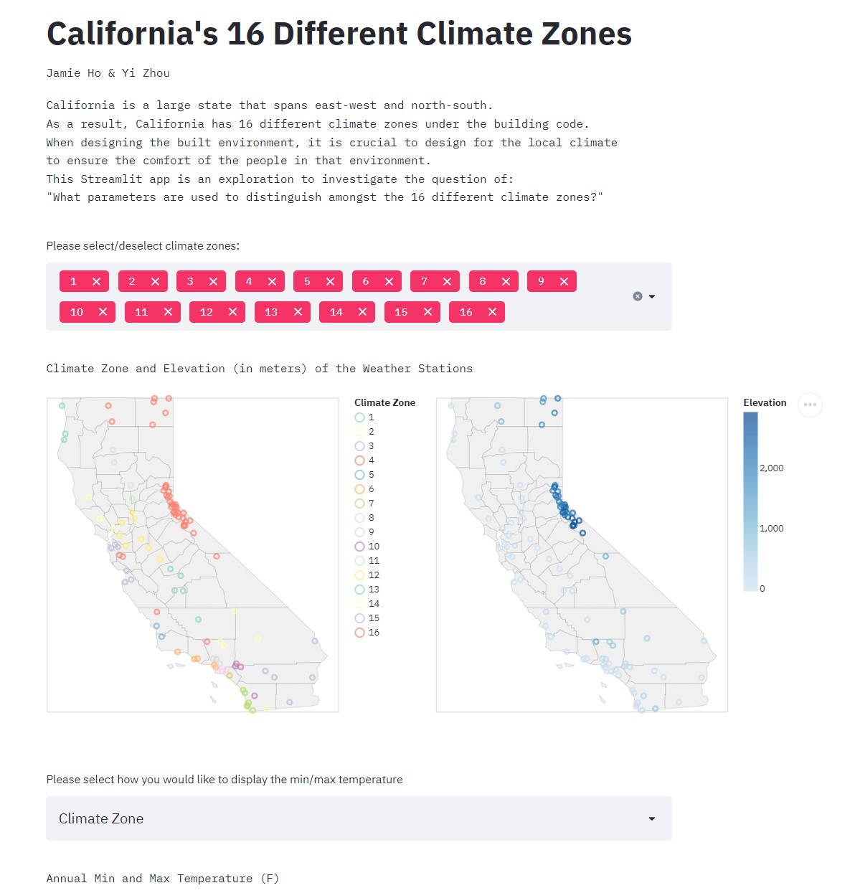

# Study on the 16 Climate Zones of California

**Abstract**
Using NOAA Daily Historical Climatology Network 2017 dataset of daily weather, this app focus on the daily and seasonal climate trends in 16 California climate zones. The first section mappes the geology and the bigger picture of temperature sort by climate zones and elevtation.  The second section focuses on the correlation inbetween major climate factors where seasonal trends can be visualized.  

## Project Goals
California is a large state that spans both east-west and north-south. As a result, California has 16 different climate zones under the building code. When designing the built environment, it is crucial to design based on the local climate to ensure the comfort of the people in that environment. Architects, engineers, and developers must not ignore the differences in the climate and treat California as one climate zone. Therefore, this Streamlit app is an exploration to investigate the question of: **What are the differences amongst the 16 different climate zones?** This guiding question will help us explore the trends that distinguish each climate zone, and which variables are correlated with each other that helps to identify a climate zone.

The data used in this Streamlit app study is from the 2017 dataset of daily weather in the US provided by the NOAA Daily Global Historial Climatology Network.

## Design
This exploration focused on two types of visual encodings to best help us answer our guiding question. In the first section of this Streamlit app, we focused on the visualising the bigger picture, particularly through the use of maps with location-based information layered on top. This visualisation method is useful to understand how location (latitude and longitude) plays a role in the weather/climate. Aside from maps, we also used a chart to visualise the full set of data for the entire 2017 year. On the maps, users can hover over the data points to see more information, such as weather station name and climate zone. On the large chart, users can hover over the data points for more information as well as changing the time frame of interest by selecting an interval with the smaller, thumbnail chart below. By default, all climate zones are shown on the two maps and large chart. Users can change the climate zone multiselect, which will reflect in the two maps and chart. This will be helpful for singling a particular climate zone or comparing between a smaller group of climate zones.

In the second section of this study, we focus on scatterplots and histograms to find possible correlation between 6 climate factors: latitude, longtitude, precipitation, snowfall, elevation and minimun temperature. We start by plotting a matrix and find out 3 most obvious correalations: latitude & minimum temperature, elevation & temperature and elevation & precipitation. We can filter by seasons in this section although the autumn season data is missing. Then we display a larger scatterplot with a polyline regression summarizing the correlation and create a multiselect interaction between the scatterplot and histogram identifying climate stations within selection.

We considered potentially using cloropleth maps to display averaged weather data, but we were unable to find or create existing datasets that have the 16 climate zones on a map. Ultimately, we decided to use counties with points plotted on top of the map. This was interesting, as we can see that county borders don't necessarily match climate zone borders.

## Development
Before splitting any work, we met together to discuss which dataset to use, what our goals are, and what questions we are interested in focusing on. After an initial look through the weather dataset, we discussed ways we can visualise the data and concluded with the two types of visual encodings as mentioned above. The first section about the big picture visualisations (maps and annual chart) was completed by Jamie Ho. The second section about the more detailed analysis on climate factor correlations (matrix, scatterplot and histograms) was completed by Yi Zhou. 

In addition to the data visualisation, adding Climate Zones to the dataset and cleaning the data was necessary. The following actions were done on the weather dataset provided by the NOAA Daily Global Historial Climatology Network:
  - Filter for only the data in the state of California
  - Remove fields that we decided not to focus on (Average temperature, Fastest wind speed)
  - Replace any missing data in the Tmin and Tmax columns with 0
  - Add additional field of Climate Zone (based on https://caenergy.maps.arcgis.com/apps/webappviewer/index.html?id=5cfefd9798214bea91cc4fddaa7e643f)

Roughly we spent 3 full days developing our application. Aspects that took the most time were preparing the data for use and integrating interactive features. Another aspect that we emphasized on was finding a good colour palette to best display the 16 climate zones. With that many climate zones, colour becomes really critical for presenting clear data. We ultimately settled on scheme set3, since it had more diverse colours.

## Success Story
From each visualisation, we were able to extract some insights:

_The Maps:_
   - Weather stations in Climate Zone 16 tend to be in areas of high elevation of approximately 1000 metres or more
   - Most weather stations in other Climate Zones tend to be in low elevation, particularly along the coastline of California

_The Annual Minimum Temperature Graph (by Climate Zone):_
   - In general, mid-June to September are the warmest months throughout the entire state of California
   - During the summer months, the range of minimum temperatures range vastly, from lowest of 20°F in Climate Zone 16 to highest of 95°F in Climate Zone 15
   - Climate Zone 16 typically has the lowest temperatures throughout the year, whereas Climate Zone 15 tends to have the highest temperatures throughout the year

_The Annual Minimum Temperature Graph (by Elevation):_
   - Elevation is correlated with temperature, where higher elevation tends to have lower minimum temperatures, which is consistent throughout the year
   - Regardless of the elevation, there is significant fluctuation in temperatures within a month (e.g., temperatures decreased then increased again in May)

_The 6x6 Matrix for Correlations:_
   - Areas in the east of California (longitude closer to -115°) tend to have higher minimum temperatures
   - Areas in the south of California (latitude closer to 30°) tend to have higher minimum temperatures
   - Areas in lower elevations tend to have higher minimum temperatures
   - Snow does not occur frequently in California, and it is not correlated with latitude, longitude, elevation, or temperature
   - Higher volume of precipitation tends to occur in areas with approximately 38-39° latitude and 120° longitude
   - Higher volume of precipitation tends not to occur when the minimum temperature is greater than 60°F

_Set of Graphs for Latitude vs Minimum Temperature:_
   - The correlation between elevation and minimum temperature is somewhat obvious where data is aggregated in some climate zones like zone 16, while in other zones the correlation is less obvious where data is widely scattered on the plot.
   - It can be roughly concluded that the minimum temperature is lower in the further north and the temperature variation is also more drastic in further north in California.

_Set of Graphs for Elevation vs Minimum Temperature:_
   - The correlation between elevation temperature is more obvious: higher the elevation, lower the temperature. Paired with the last correlation, we can conclude that  elevation and latitude doesn’t necessarily correlate with each other.
   - The data is scattered unevenly on the scatterplot: most climate zones have a similar elevation Since California is mainly flat, except for some hilly counties in the north. For example, climate zone spans from the north end to the midsouth part and the average minimum temperature is thus lower. 

_Set of Graphs for Elevation vs Precipitation:_
   - The correlation between elevation and precipitation is somewhat unobvious. We can roughly conclude that more north of california tends to have more trends towards rain, but there are also moderate amount of rain in lower elevation where the majority of California sit at. 
   - There’s no definite answer to this correlation: humidity and might be a better hint in terms of precipitation. Since the autumn season data is missing, a full dataset of all weather stations in california for all days of the year is needed to make more detailed conclusions.
